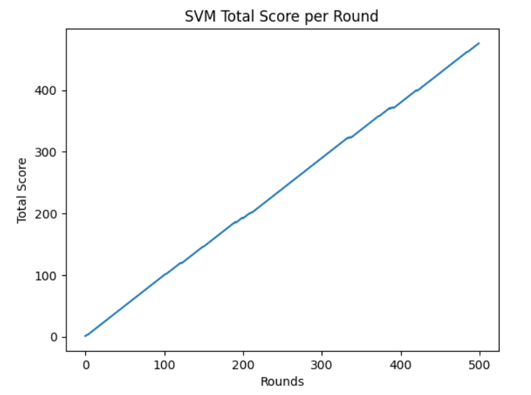
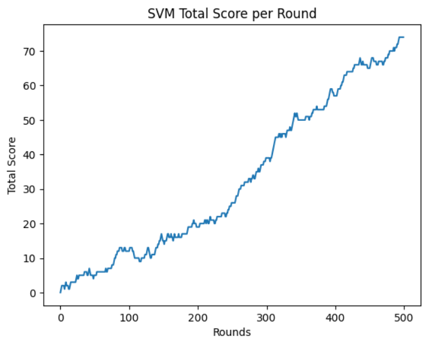
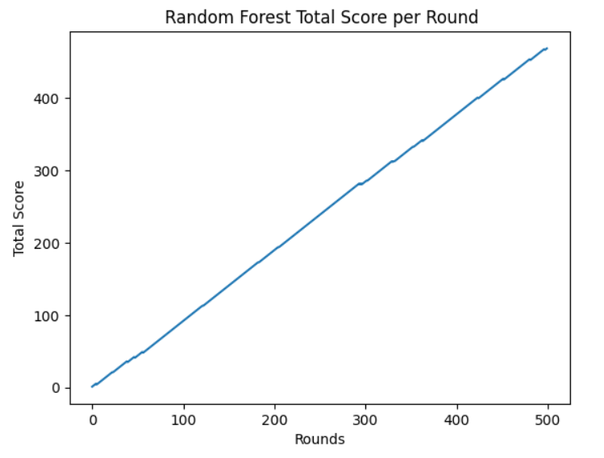
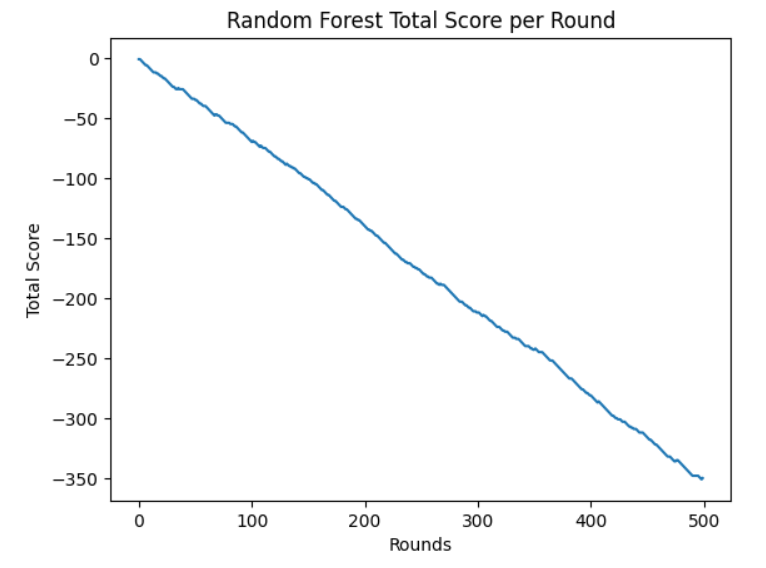
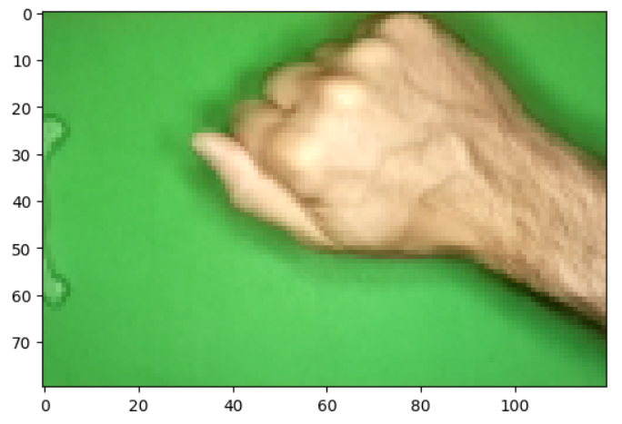
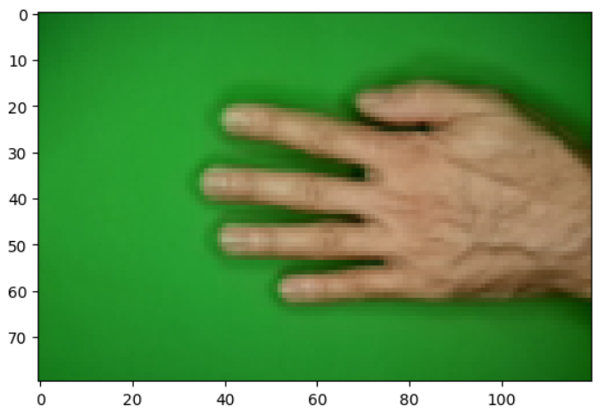

# Rock Paper Scissors
## Introduction
Στην παρούσα εργασία εκπαιδεύουμε διάφορα μοντέλα μηχανικής
μάθησης για την κατηγοριοποίηση εικόνων στο παιχνίδι 
πέτρα, ψαλίδι, χαρτί. Η απόδοση του κάθε μοντέλου εξετάζεται 
σε ένα προσομοιωμένο περιβάλλον του παιχνιδιού, όπου το μοντέλο έρχεται 
αντιμέτωπο με ένα τυχαίο πράκτορα. Ο τυχαίος πράκτορας αλλοιώνει
τις εικόνες αναποδογυρίζοντας τες τυχαία σε κάθε άξονα και εφαρμόζοντας κάποιο θόρυβο.
Το παιχνίδι παίζεται σε γύρους. Σε κάθε γύρο αν το μοντέλο κερδίσει παίρνει ένα πόντο, αν χάσει
χάνει ένα πόντο και αν έχουμε ισοπαλία δεν κερδίζει κάποιο πόντο. 
## Dataset 1
Το πρώτο dataset βρίσκεται [εδώ](https://www.kaggle.com/datasets/drgfreeman/rockpaperscissors)
Περιλαμβάνει εικόνες χεριών που κάνουν χειρονομίες για να 
συμβολίσουν την πέτρα, το ψαλίδι και το χαρτί μπροστά από μία πράσινη οθόνη.
Οι εικόνες είναι μεγέθους 300x200.
## Dateset 2
Το δεύτερο dataset βρίσκεται [εδώ](https://www.kaggle.com/datasets/yash811/rockpaperscissors/data)
Περιλαμβάνει εικόνες χεριών που κάνουν χειρονομίες για να 
συμβολίσουν την πέτρα, το ψαλίδι και το χαρτί μπροστά από τυχαίες τοποθεσίες.
Οι εικόνες είναι μεγέθους 300x350.
## Preprocessing
- Μείωση μεγέθους της εικόνας σε 120x80.
- Διαχωρισμός σε train και test με ποσοστό 80-20
- Αύξηση του train set με όλους τους δυνατούς τρόπους αναποδογυρίσματος της εικόνας
- Κανονικοποίηση σε κλίμακα [0,1]
- Μείωση διαστάσεων με pca και 80% διακύμανση
## Results
### SVM 
Ο λόγος που χρησιμοποιούμε svm είναι επειδή το dataset είναι μικρό και έχουμε μικρό αριθμό διαστάσεων μετά το pca.
Για το πρώτο dataset το μοντέλο μας είχε 484 νίκες, 8 ήττες και 8 ισοπαλίες.
Το συνολικό score του μοντέλου για κάθε γύρο φαίνεται στο παρακάτω plot με τελικό score 476.

Για το δεύτερο dataset το μοντέλο μας είχε 130 νίκες, 56 ήττες και 314 ισοπαλίες.
Το συνολικό score του μοντέλου για κάθε γύρο φαίνεται στο παρακάτω plot με τελικό score 74.

### Random Forest
Ο λόγος που χρησιμοποιούμε random forest είναι επειδή συνήθως τα ensemble μοντέλα αποδίδουν καλά και έχουν υψηλή αντοχή στο overfitting.
Για το πρώτο dataset το μοντέλο μας είχε 481 νίκες, 12 ήττες και 7 ισοπαλίες.
Το συνολικό score του μοντέλου για κάθε γύρο φαίνεται στο παρακάτω plot με τελικό score 469.

Για το δεύτερο dataset το μοντέλο μας είχε 11 νίκες, 361 ήττες και 128 ισοπαλίες.
Το συνολικό score του μοντέλου για κάθε γύρο φαίνεται στο παρακάτω plot με τελικό score -350.

## False Classification
Σε ορισμένες περιπτώσεις το μοντέλο αδυνατούσε να κάνει σωστή πρόβλεψη. Για παράδειγμα στην παρακάτω εικόνα 
το μοντέλο έκανε πρόβλεψη χαρτί αντί για πέτρα.

Σε αυτήν την εικόνα το μοντέλο έκανε πρόβλεψη ψαλίδι αντί για χαρτί. Αυτό μπορεί να οφείλεται στο γεγονός ότι η συγκεκριμένη
χειρονομία μπορεί να αντιληφθεί σαν ψαλίδι λόγω του ανοίγματος των δακτύλων του χεριού.

Για την αποφυγή παρόμοιων σφαλμάτων κατηγοριοποίησης εφαρμόσαμε μείωση διαστάσεων με pca έτσι ώστε να κρατήσουμε
τα σημαντικότερα χαρακτηριστικά του dataset.

## Conclusion
Συμπεραίνεται ότι τα svm φαίνεται να αποδίδουν καλύτερα από τα random forest και στα δύο
dataset. Είναι ενδιαφέρον να σημειωθεί ότι ακόμα και στο δεύτερο dataset, το svm καταφέρνει
να κάνει σωστές προβλέψεις σε ικανοποιητικό βαθμό, παρόλο που είναι εκπαιδευμένο μόνο 
στο πρώτο. Από την άλλη πλευρά το random forest δεν καταφέρνει να κάνει σωστές προβλέψεις στο δεύτερο dataset. 

